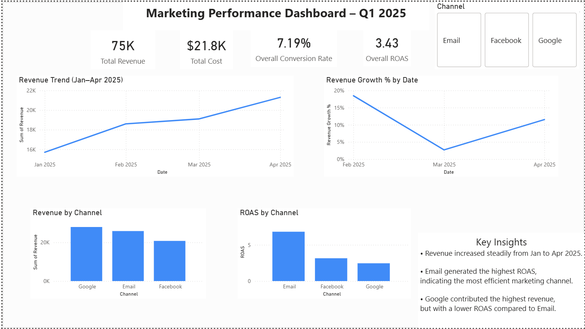

# Data Analytics Portfolio

Power BI dashboards showcasing marketing and business performance analysis.

This repository contains my Business Intelligence and Data Analytics projects built using Power BI.

---

## Project 1: Marketing Performance Dashboard

### Tools Used
- Power BI
- Data Visualization
- Marketing Analytics

### Project Overview
This Power BI dashboard analyzes marketing performance across multiple channels including Google, Email, and Facebook.

### Key Metrics
- Total Revenue
- Total Cost
- Conversion Rate
- Return on Ad Spend (ROAS)

### Key Insights
- Revenue increased steadily from January to April 2025.
- Email generated the highest ROAS, indicating the most efficient marketing channel.
- Google contributed the highest revenue but had a lower ROAS compared to Email.

### Files

- dashboard_preview.png — Dashboard screenshot preview
- marketing_performance_dashboard.pbix — Power BI project file
- marketing_performance_dashboard.pdf — Exported dashboard preview
